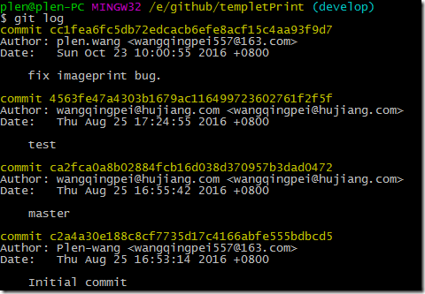
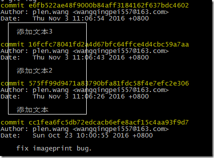
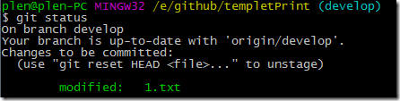
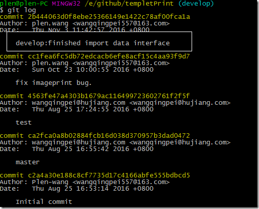

原文：聊下git merge --squash - [https://www.cnblogs.com/wangiqngpei557/p/6026007.html](https://www.cnblogs.com/wangiqngpei557/p/6026007.html)

你经常会面临着将dev分支或者很多零散的分支merge到一个公共release分支里。

但是有一种情况是需要你处理的，就是在你的dev的分支里有很多commit记录。而这些commit是无需在release里体现的。

develop 主分支

develop主分支最近的一个commit是”fix imageprint bug.”。我们拉出一个分支进行项目开发，里面会有很多commit记录。

git checkout -b develop_newfeature_ImportDataInterface origin/develop

develop_newfeature_ImportDataInterface 分支的commit log是和develop是一模一样的。我们添加点修改commit。

现在我们需要将develop_newfeature_ImportDataInterface 分支的commit merge到develop主分支里去。在合并进develop的时候我们希望在develop里的commit log里只看见一次commit，而且这个commit的message不是很随意的，而是符合正规提交流程的约定格式的，比如，”develop:finished import data interface”。

我们就需要借助git merge –squash命令参数来重新准备提交。（这是一个明确的merge操作不同于git rebase，不要搞混淆这两个命令的作用。）

git merge --squash develop_newfeature_ImportDataInterface

Updating cc1fea6..e6fb522 
Fast-forward 
Squash commit -- not updating HEAD 
1.txt | 3 +++ 
1 file changed, 3 insertions(+)

--squash 会暂停commit提交。要不然一个merge会自动提交commit。

1.txt文件是我们修改的文件，它现在待commit。现在我们只需要重新提交即可。

git commit -m'develop:finished import data interface'

这样每次merge就会很清爽，一目了然，就算回头reset也方便。